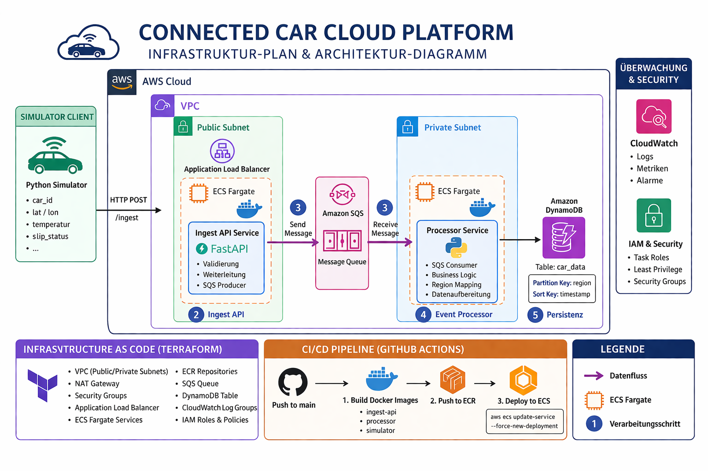

# 🚗 Connected Car Cloud Platform  
## Scalable Event-Driven AWS Microservices Architecture

> **Production-style cloud platform simulating real-time vehicle telemetry using AWS, Terraform, Docker, and CI/CD automation**

---

## 📌 Project Overview

This project showcases the design and implementation of a **scalable, event-driven cloud platform** for connected vehicles using **AWS cloud-native services**.

It simulates real-time telemetry data from vehicles, ingests it via a REST API, processes it asynchronously, and stores structured data in a highly scalable NoSQL database.

### 🎯 Key Highlights

- Event-driven architecture using **Amazon SQS**
- Fully containerized microservices deployed on **ECS Fargate**
- Infrastructure provisioned via **Terraform (IaC)**
- Automated **CI/CD pipeline with GitHub Actions**
- Secure, production-like cloud environment following best practices

---

## 🏗️ Architecture Overview



### 🔄 End-to-End Flow

1. **🚘 Car Simulator**
   - Generates realistic telemetry data:
     - `car_id`
     - GPS coordinates (`latitude`, `longitude`)
     - `temperature`
     - `road/slip conditions`

2. **🌐 Ingest API (FastAPI)**
   - Deployed on **ECS Fargate**
   - Exposed via **Application Load Balancer**
   - Validates incoming data
   - Publishes messages to **Amazon SQS**

3. **📬 Message Queue (SQS)**
   - Decouples ingestion from processing
   - Handles traffic spikes
   - Enables asynchronous workflows

4. **⚙️ Processor Service**
   - Consumes messages from SQS
   - Applies business logic (**geo-based region mapping**)
   - Writes processed data to DynamoDB

5. **🗄️ Data Storage (DynamoDB)**
   - **Partition Key:** `region`
   - **Sort Key:** `timestamp`
   - Optimized for high-throughput, time-series data

---

## ☁️ AWS Services & Technologies

### Core AWS Services

- **Amazon VPC** (Public & Private Subnets)
- **Application Load Balancer (ALB)**
- **Amazon ECS Fargate**
- **Amazon ECR**
- **Amazon SQS**
- **Amazon DynamoDB**
- **AWS IAM**
- **Amazon CloudWatch**

### 🧰 Tech Stack

- **Backend:** Python (FastAPI)
- **Infrastructure:** Terraform
- **Containerization:** Docker
- **CI/CD:** GitHub Actions
- **Cloud:** AWS

---

## 🔐 Security & Best Practices

- 🔒 Workloads isolated in a dedicated **VPC**
- 🌐 Public access restricted to API via **ALB only**
- 🔁 Backend services run in **Private Subnets**
- 🔑 **IAM Roles** used instead of hardcoded credentials
- ⚖️ Strict **Least Privilege Principle**
- 📊 Centralized logging via **CloudWatch**

---

## 🛠️ Infrastructure as Code (Terraform)

All infrastructure is defined declaratively using **Terraform**.

### 📁 Core Modules

| Module        | Description                          |
|--------------|--------------------------------------|
| `vpc.tf`     | Networking & routing                 |
| `alb.tf`     | Load balancer configuration          |
| `ecs.tf`     | ECS cluster & services               |
| `iam.tf`     | Roles & permissions                  |
| `sqs.tf`     | Messaging layer                      |
| `dynamodb.tf`| Database configuration               |

### ✅ Benefits

- No manual setup (**No ClickOps**)
- Fully reproducible environments
- Clean separation of infrastructure components

---

## 🐳 Containerized Microservices

Each service is independently containerized:

- `ingest-api`
- `processor`
- `simulator`

Docker images are:

- Built locally & in CI
- Stored in **Amazon ECR**
- Deployed automatically to ECS

---

## 🔄 CI/CD Pipeline

Implemented using **GitHub Actions** for full automation.

### 🚀 Pipeline Flow

Triggered on push to `main`:

1. Checkout repository
2. Configure AWS credentials
3. Authenticate with ECR
4. Build Docker images
5. Push images to ECR
6. Deploy updated containers to ECS

### 💡 Outcome

- ⚡ Zero-downtime deployments
- 🔁 Fully automated delivery
- 📦 Consistent container updates

---

## 📂 Project Structure

```bash
.
├── app/
│   ├── ingest-api/
│   ├── processor/
│   └── simulator/
├── terraform/
│   ├── vpc.tf
│   ├── ecs.tf
│   ├── iam.tf
│   ├── alb.tf
│   ├── sqs.tf
│   └── dynamodb.tf
├── .github/
│   └── workflows/
│       └── deploy.yml
├── Docs/
│   └── architecture.png
├── README.md
└── LICENSE
